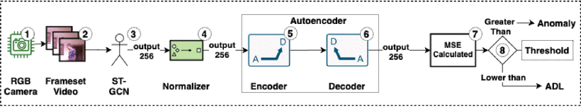
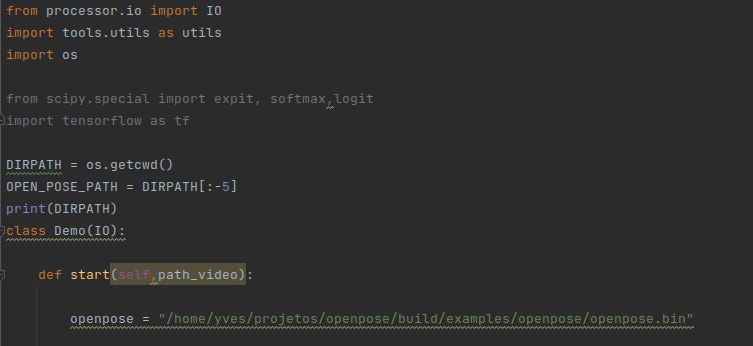

# A Framework for Anomaly Identification Applied on Fall Detection


## Abstract:
*Automatic systems to monitor people and subsequently improve people’s lives have been emerging in the last few years, and currently, they are capable of identifying many activities of daily living (ADLs). An important field of research in this context is the monitoring of health risks and the identification of falls. It is estimated that every year, one in three persons older than 65 years will fall, and fall events are associated with high mortality rates among the elderly. We propose an anomaly identification framework to detect falls, which incorporates a spatial-temporal convolutional graph network (ST-GCN) as a feature extractor and uses an encoder process to reconstruct ADLs and identify falls as anomalies. As the publicly available fall datasets are few and generally unbalanced, training a reliable model using approaches that need explicit labeling is challenging. Thus, a focus on learning without external supervision is desirable. Treating a fall as an exception of ADLs allows us to recognize falls as anomalies without explicit labels. Given its modular architecture, our framework can robustly represent visual information and use the encoder’s reconstruction error to identify falls as anomalies. We assess our framework’s ability to recognize falls by training it with only ADLs. We perform three types of experiments: single dataset training and evaluation that consists of separate 90% of the data to train the model 5% to adjust the model, and the rest to the test. A joint dataset experiment, where we combine two datasets to increase the number of samples our model is trained on, and a cross-dataset evaluation, where we train on one dataset and evaluate using another one. Besides presenting state-of-the-art results on our experiments, particularly on the cross-dataset one, the model also presents a low number of false events, which makes it an ideal candidate for real-world application.*

## Model:

Our framework’s primary purpose is to identify falls without the need for previous knowledge of these events. In this case, we have chosen to use an encoder model capable of identifying anomalies based on reconstruction error. As the public datasets have only a few samples of falls, we decided to use a pre-trained ST-GCN in a high-dimensional dataset as a feature extractor. 



The first step of our framework is to capture a frameset of a video using an RGB camera. Then the entire frameset is used as input for the ST-GCN model with OpenPose. We normalize the data of the middle layer of the ST-GCN model. This step completes our framework’s pre-processing phase. In the next phase, our framework tries to encode/decode the resulting data. So, we calculate the Mean-Squared Error (MSE), and the value obtained is compared with a threshold. If the calculated value is greater than the pre-defined threshold, an anomaly is identified.

See all details [here](09439497.pdf)

## Pre-requisites

All requirements are listed in the requirements.txt file. For the pre-process new datasets, you need to install the OpenPose and configure the directory in the processor/demo_fall_det.py file. as the following:



You need to install too the ST-GCN model, we have used the following version of the ST-GCN model [here](https://github.com/yysijie/st-gcn/blob/master/OLD_README.md).

## Citing:

```
@ARTICLE{
  9439497,  
  author={Galvão, Yves M. and Portela, Letícia and Ferreira, Janderson and Barros, Pablo and De Araújo Fagundes, Oberta Andrade and Fernandes, Bruno J. T.},
  journal={IEEE Access},
  title={A Framework for Anomaly Identification Applied on Fall Detection},
  year={2021},
  volume={9},
  number={},
  pages={77264-77274},
  doi={10.1109/ACCESS.2021.3083064}
}
```
